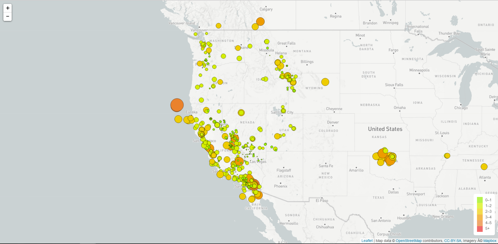

Assignment - Visualizing Data with Leaflet

This visualization will fetch earthquake data from the last 7 days and plot epicenters on a global map. 

Check it out!

Site published Here https://dougaf.github.io/Leaflet_earthquakeMap/

Basic Visualization

The task is to visualize an earthquake data set like the above image.

To do this. We’ll need to use a mapbox API and Leaflet.js to create the initial map. Then using Leaflet in logic.js we can create a custom plot of the data we pull from the below GeoJSON API.

Data source https://earthquake.usgs.gov/earthquakes/feed/v1.0/geojson.php

